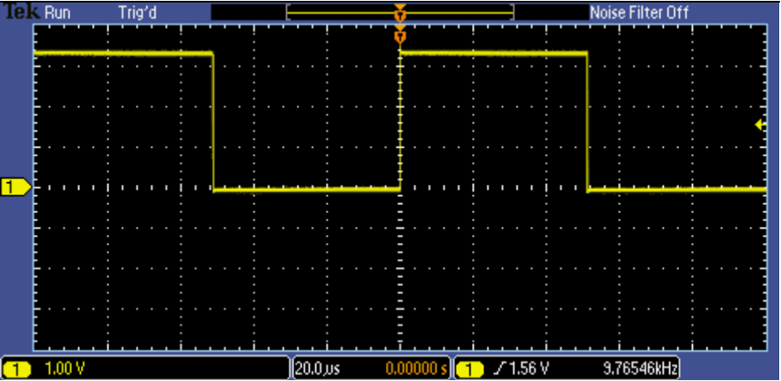
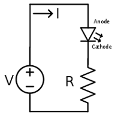
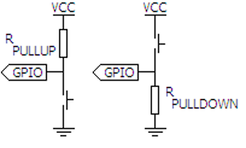

# CPE 301 – Embedded Systems Design Lab
## Lab # 01 – Oscilloscopes, LEDs, Resistors and Push-buttons
## Objectives:

Oscilloscopes and basic lab components such as resistors, buttons, switches, and LEDs will be
critical components in future labs. Therefore, knowledge of how they work and how they should be used
is a foundation for future lab assignments. In this lab you will learn:

1. How to manipulate the controls of the laboratory oscilloscopes.
2. How to measure and display a signal using the laboratory oscilloscopes.
3. How to use the laboratory power supplies.
4. The basics of LEDs.
5. How to construct a pullup push button circuit.
8. How to construct a pulldown push button circuit.

## Contents:

- Part 1 – Oscilloscope configuration and signal measurement.
- Part 2 – Measure an arbitrary signal from the provided test circuit.
- Part 3 – Connect the power supply, a resistor, and an LED to light the LED.
- Part 4 – Construct a pullup push button circuit and a pulldown push button circuit.

## Required Equipment:

1. Laboratory Oscilloscope
2. Laboratory Power Supply
3. 3mm Through-hole LED
4. Through-hole Push Buttons (x2)
5. 330 Ω Axial Resistor (x2)
6. Solderless Breadboard

## Procedure:

**This lab requires you to create a lab report. The report you turn in to Webcampus must be in PDF format. Do not turn in images or Word documents.**

Complete each part of the lab, answer the questions and include them in your lab report. Be
sure to label your answers with respect to their relevant lab part and question number (ex. Part 1 #4c).
Any handwritten drawings should be scanned and included alongside the text of your lab report.

## Part 1 – Oscilloscope Configuration and Signal Measurement

Answer the questions below using the Intro\_to\_Scopes\_Lab.pdf on Webcampus, as well as any online
resources. List any online resources you used in the references section of your lab report.

1. What does an oscilloscope measure?
2. What is the function of the alligator clip connected to the oscilloscope probe? To what should it be
   connected? What happens if the clip is left unconnected?

3. Many oscilloscope probes feature a switch which allows the user to change the probe between 1X
   and 10X. What is the function of this slide switch? Why should we not utilize function generator
   cables as oscilloscope probes?
4. What is the minimum oscilloscope performance required to properly capture 2 msec of a 1V, 250
   MHz sine wave? (List the required Bandwidth, Sample Rate, and Record Length)
5. Answer the questions below based on the display shown here:

   
  
   a. What is the peak-to-peak voltage of the signal?
   
   b. What is the voltage of the positive peak?
   
   c. What is the voltage of the negative peak?
   
   d. What is the period and frequency of the signal?
   
   e. What does the yellow arrow contained within the red circle on the image above
denote?

1. What does the yellow arrow contained within the green circle on the image above
denote?

6. An oscilloscope’s vertical axis controls are used to control which parameter?
7. Connect your oscilloscope probe to the PROBE COMP square wave output on the front of the
   oscilloscope. To make the highest resolution measurement, what vertical scale should be used to
   measure the PROBE COMP square wave? Why?
8. If the horizontal scale factor were set to 1 μsec/div, how long would the displayed waveform be?
9. With the horizontal scale factor set to 200 μsec/div and the record length set to 1 Mpoints, what is
   the oscilloscope’s sample rate? Verify your answer by looking at the acquisition details on the
   oscilloscope.
10. Move the trigger control in and out of the signal’s voltage range and observe what happens to the
    display. What does the trigger do?
11. There are multiple types of triggers, one of which is a pulse width trigger. To trigger on all square
    waves faster than 500 Hz with a 50% duty cycle, what parameters of the pulse width trigger would
    you set? (List the when and width settings)
12. Manual Measurements – Connect your oscilloscope probe to the PROBE COMP square wave output
    on the front of the oscilloscope.
  1. Determine the amplitude of the signal by counting the number of vertical divisions on the graticule and multiplying that by the vertical scale factor.
  1. Calculate the period of the signal by counting the number of horizontal divisions on the graticule and multiplying that by the horizontal scale factor.
  1. Calculate the frequency of the signal by performing the following calculation: Frequency = 1/(signal period)

13. Cursor Measurements - Connect your oscilloscope probe to the PROBE COMP square wave output
    on the front of the oscilloscope.
    
    a. Use the cursor menu of the oscilloscope to determine the signal amplitude.
    
    b. Use the cursor menu of the oscilloscope to determine the signal period.
    
    c. Recalculate the signal’s frequency. Is this calculation more accurate than the manual
    measurements?
    
14. Automatic Measurements - Connect your oscilloscope probe to the PROBE COMP square wave
    output on the front of the oscilloscope.
    
    a. Record the results of the peak-to-peak amplitude and period automated measurements.
    
    b. Recalculate the signal’s frequency. From the frequency calculations in 10,11, and 12a,
    calculate the percent difference between the manual measurement and the automatic
    measurements, and the percent difference between the cursor measurements and the
    automatic measurements.
    
    c. Briefly explain the difference between the three different measurement techniques, and
    which technique should be used for what purposes.

## Part 2 – Arbitrary Signal Measurement

When you have completed the above exercises, notify the lab instructor. The instructor will give you a
circuit which generates a test signal, and tell you a circuit ID which identifies the correct frequency and
amplitude to the instructor. Record the circuit ID as well as the frequency, period and amplitude of the
signal in your report.

## Part 3 – Lighting an LED

Using the lab power supply, and LED and a resistor construct the circuit depicted below, be sure to use
the fixed 5V output on the power supply:

When the circuit is complete, notify the lab instructor, then answer the following questions:

1. What is the voltage drop across the terminals of the power supply?
2. What is the voltage drop across the legs of the LED?
3. What is the voltage drop across the legs of the resistor?
4. Do the voltage drops sum to the expected value? Explain what the expected value is.
5. Using Ohm’s law (V = IR), calculate the current flowing through the circuit.
6. If the power rating of an LED is 10W, and the circuit’s power supply is fixed at 5V, what size
   resistor would you use to result in the brightest LED without burning it out? (Remember P = VI)
7. What happens when you reverse the LED? Why does this happen?

## Part 4 – Pullups, Pulldowns, and Push-buttons

Using the lab power supply, and push button and a resistor construct the circuits depicted below, be
sure to use the fixed 5V output on the power supply:

When the circuit is complete, notify the lab instructor, then answer the following questions:

1. Measure the point in both circuits labelled GPIO. For both circuits, what is the voltage at the
   measurement point when the button is not pressed? What is the voltage when the button is
   pressed?
2. What is the function of the resistor? What would happen if the circuit did not include a resistor?
3. Most microcontrollers can accept digital inputs. Where would you connect a microcontroller’s
   digital input pin to the above circuits to read the state of the push button?
4. What is the functional difference between a push button and a toggle switch? Draw both of the
   above circuits, but substitute a toggle switch for the push button. Include the drawings in your
   lab report, and label where the signal from the switches should be measured.

)